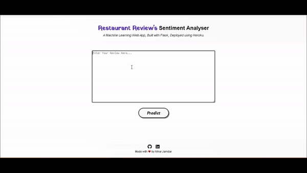

# Sentiment Analysis of Restaurant Reviews

Deployed at: https://hotel-review123.herokuapp.com/

## Problem Statement
Given a review by a Customer we have to determine whether it belongs to Positive review or Negative review. Eg:1 i.e. Review 1: Wow this place really gives me good vibe as well as the fish cury is also Awesome as always. Ans: Positive Review. Eg:2 i.e. Review 2 This Dish is not at all tasty as well as waitress was a little slow in service. Ans: Negative Review. So our main Task is to predict wheatear the given review is positive or negative i.e. Binary Classification.

### Workflow

### Modelling: 

#### 1.Decision Tree: A decision tree is a decision support tool that uses a tree-like model of decisions and their possible consequences, including chance event outcomes, resource costs, and utility. It is one way to display an algorithm that only contains conditional control statements.

#### 2.Stochastic Gradient Descent: Stochastic Gradient Descent (SGD) classifier basically implements a plain SGD learning routine supporting various loss functions and penalties for classification. Scikit-learn provides SGD Classifier module to implement SGD classification.

#### 3.Logistic Regression: Logistic Regression is used for binary as well as for multiclass classification. Where it uses sigmoid function to reduce cost function. In the multiclass case, the training algorithm uses the one-vs-rest (OvR) scheme. If the option chosen is ‘ovr’, then a binary problem is fit for each label.

